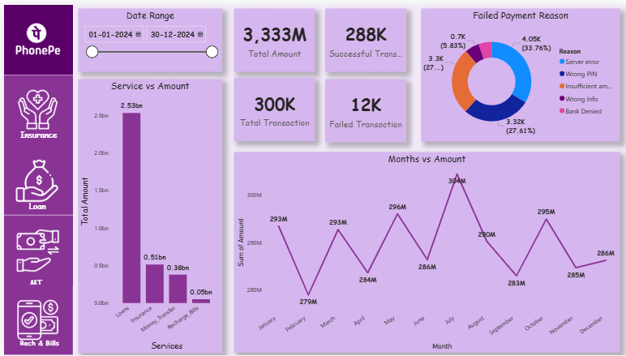

# 🧾 PhonePe Transaction Analysis – Digital Payments in India (Excel & Power BI)

_Analyzing UPI transaction trends and regional digital payment adoption in India using Microsoft Excel and Power BI._

---

## 📌 Table of Contents

<a href="#overview">Overview</a>

<a href="#business-problem">Business Problem</a>

<a href="#dataset">Dataset</a>

<a href="#tools--technologies">Tools & Technologies</a>

<a href="#project-structure">Project Structure</a>

<a href="#data-cleaning--preparation">Data Cleaning & Preparation</a>

<a href="#exploratory-data-analysis-eda">Exploratory Data Analysis (EDA)</a>

<a href="#key-insights--findings">Key Insights & Findings</a>

<a href="#dashboard">Dashboard</a>

<a href="#how-to-run-this-project">How to View This Project</a>

<a href="#final-recommendations">Final Recommendations</a>

<a href="#author--contact">Author & Contact</a>

---
<h2><a class="anchor" id="overview"></a>Overview</h2>

This project analyzes Phonepay UPI transaction data to understand digital payment trends, regional performance, and growth patterns across India.
The entire analysis was performed using Excel for data cleaning and preparation and Power BI for visualization and insights.

---
<h2><a class="anchor" id="business-problem"></a>Business Problem</h2>

With the rapid adoption of UPI payments, fintech platforms need actionable insights to:

-Identify high- and low-performing states and districts

-Track transaction growth over time

-Understand regional adoption of digital payments

-Support strategic planning and expansion decisions

---
<h2><a class="anchor" id="dataset"></a>Dataset</h2>

Source: Phonepay Pulse (Public Dataset)

Format: CSV (converted to Excel)

Data Includes:

-Transaction count and value

-State and district-level data

-Year and quarter information

-Transaction categories

---

<h2><a class="anchor" id="tools--technologies"></a>Tools & Technologies</h2>

- Microsoft Excel

    -Data cleaning & transformation

    -Pivot tables

    -Calculated columns & measures

- Power BI

    -Data modeling

    -DAX measures

    -Interactive dashboards

- GitHub – Project hosting & documentation

---
<h2><a class="anchor" id="project-structure"></a>Project Structure</h2>

```
phonepe-data-analysis/
│
├── README.md
│
├── data/
│   ├── raw/                  # Original PhonePe datasets
│   └── cleaned/              # Excel cleaned data files
│
├── dashboard/
│   └── phonepe_dashboard.pbix
│
├── images/
│   └── dashboard.png

```

---
<h2><a class="anchor" id="data-cleaning--preparation"></a>Data Cleaning & Preparation</h2>

Data cleaning and transformation were performed in Excel, including:

-Removal of null and duplicate values

-Standardization of state and district names

-Conversion of data types

-Creation of calculated fields

-Aggregation by state, district, year, and quarter

---
<h2><a class="anchor" id="exploratory-data-analysis-eda"></a>Exploratory Data Analysis (EDA)</h2>

Key analysis performed:

-Year-over-year transaction growth

-State-wise and district-wise transaction distribution

-Transaction type contribution analysis

-Quarterly trend comparison

-Identification of high-growth regions

---
<h2><a class="anchor" id="key-insights--findings"></a>Key Insights & Findings</h2>

1. Top States by Transaction Value

    -Maharashtra, Karnataka, and Telangana consistently lead

2. Growth Trend

    -Strong and consistent growth in UPI transactions year-over-year

3. Regional Adoption

    -Urban regions dominate transaction volumes

4. Transaction Categories

    -Peer-to-peer payments account for the majority of transactions

5. Seasonality

    -Higher transaction activity observed in Q3 and Q4

---
<h2><a class="anchor" id="dashboard"></a>Dashboard</h2>

The Power BI dashboard provides:

    -State-wise and district-wise transaction analysis

    -Year and quarter filters

    -Transaction value and count KPIs

    -Clear visual insights for decision-makers



---
<h2><a class="anchor" id="how-to-run-this-project"></a>How to View This Project</h2>

1. Clone the repository:
```bash
git clone https://github.com/Nityanand-Khule-24/phonepay-analysis-excle-powerbi-.git
```

2. Open Power BI Dashboard:
   - `dashboard/dashboard/phonepay.pbix`

3. Review cleaned datasets in the data/cleaned/ folder.


---
<h2><a class="anchor" id="final-recommendations"></a>Final Recommendations</h2>

- Increase marketing efforts in underpenetrated states

- Leverage high-growth quarters for targeted campaigns

- Expand digital services in emerging districts

- Use dashboards for continuous monitoring of adoption trends

---
<h2><a class="anchor" id="author--contact"></a>Author & Contact</h2>

*** Nityanand Khule ***
Aspiring Data Analyst 
📧 Email: nityanandkhule24@gmail.com  
🔗 [LinkedIn](https://www.linkedin.com/in/nityanand-khule/)  
